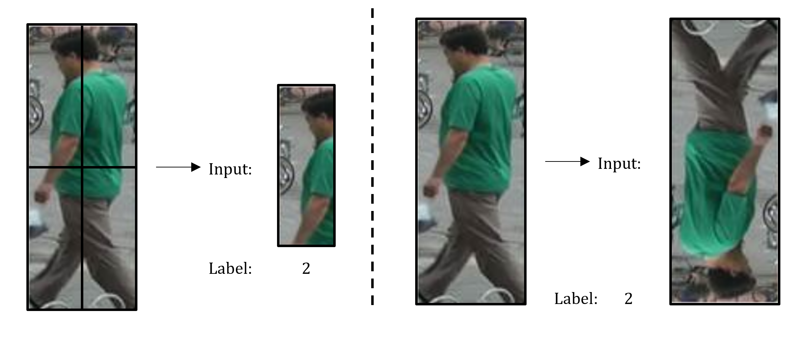

## Self-Supervised Feature Learning for Multi-Object Tracking
### Project Overview
This project investigates the use of self-supervision for learning useful features for pedestrian tracking. Several pretext tasks are considered for transfer learning with a pre-trained ResNet-18. Additionally, a fully self-supervised autoencoder network is trained for comparision with the pre-trained network. All networks are compared to the Deep Cosine Metric network from [DeepSORT](https://arxiv.org/abs/1703.07402).

We make use of the [DeepSORT](https://github.com/nwojke/deep_sort) code repository as the MOT backbone and [TrackEval](https://github.com/JonathonLuiten/TrackEval) to compute the MOT Metrics.

### Self-Supervised Pretext Tasks
We consider the pretext tasks of jigsaw puzzle recognition and rotation prediction with the goal of embuing the pre-trained ResNet-18 with a contextually relevant feature description. The [MARS](http://zheng-lab.cecs.anu.edu.au/Project/project_mars.html) dataset is used for training these tasks. A sample input for these tasks is shown.

     

### Self-Supervised Autoencoder
An autoencoder is trained on the image reconstruction task using the [MS COCO](https://cocodataset.org/#home) dataset. The network learns to reduce the image to a 1x512 feature vector via an encoder and fully-connected layer and subsequently reconstruct the image using a decoder. Sample results from this process are shown.

     

### MOT Evaluation
The networks are evaluated on the [MOT17](https://motchallenge.net/data/MOT17/) training split. The results are tabulated and compared to the baseline Cosine Metric Learning model in the CLEAR MOT metrics.

     

The results show that the auto-encoder produces results competitive with the pre-trained ResNet and baseline model, but falls short on providing a feature vector conducive for person re-identification, as the baseline model outperforms all self-supervised and pre-trained efforts in terms of ID switching.
